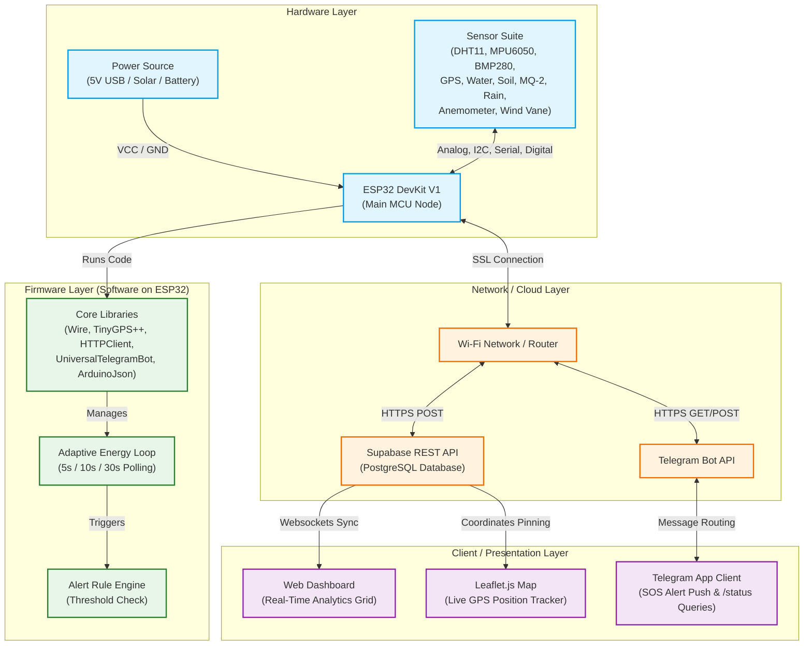
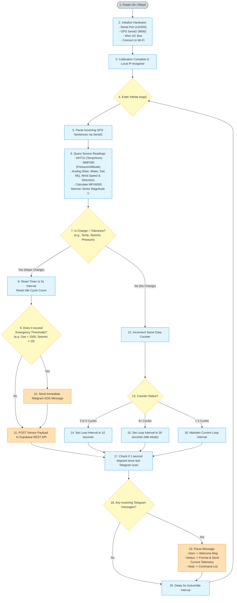

# 📡 ResQLink System Architecture & Execution Flow Chart

This document outlines the complete hardware-software system architecture and the firmware execution logic for the ResQLink Disaster Telemetry Station.

---

## 1. 🏗️ System Architecture

The ResQLink ecosystem is structured into four main layers: **Hardware**, **Firmware (MCU Software)**, **Cloud/Network**, and **Client/Presentation**.

---

## 2. 🔄 Firmware Logic Execution Flow

The flow chart below illustrates the step-by-step firmware loop running inside the ESP32 microcontroller, showing the telemetry acquisition, rule evaluation, adaptive power throttling, and external communications.

### 🖼️ Visual Flow Chart

### 📊 Logic Flow Diagram

---

## 3. 📝 Component Matrix Breakdown

| Module | Purpose (System Role) | Software Driver / Library | Data Output Type |
| :--- | :--- | :--- | :--- |
| **ESP32 Core** | central compute, data processing, routing | Arduino ESP32 Board Core | Wi-Fi IP, RSSI signal |
| **DHT11** | local thermal & humidity monitoring | `DHT.h` (Adafruit) | Float (Celsius / %) |
| **MPU6050** | seismic tremor & structural vibration | `Adafruit_MPU6050.h` | 3-axis Accelerometer Vector |
| **BMP280** | micro-climate storm warning, altitude tracker | `Adafruit_BMP280.h` | Float (hPa / Meters) |
| **NEO-6M GPS** | geolocation tracking & command map locking | `TinyGPS++.h` | Double (Latitude / Longitude) |
| **Analog Suite** | flood levels, dry drought, gas leak, rainfall, wind | Standard ADC (`analogRead`) | Integer (0 - 4095 ADC) |
| **UniversalTelegramBot** | alert routing, query responder | `UniversalTelegramBot.h` | Secure JSON messages |
| **HTTPClient** | remote database sync | `HTTPClient.h` | HTTPS POST requests |
